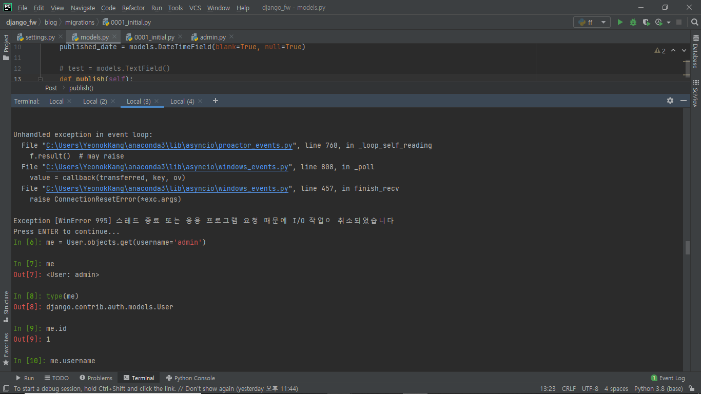

# 오늘의 에러

> 오늘은 감정을 낮추고 좀 더 깔끔하게 정리할 수 있을 것 같다.
>
> 비교적 풀기 쉬웠거든.


##### 1. 모듈을 찾을 수 없어요

```
python manage.py migrate
```


`1st trial` : 순서를 뒤죽박죽 만들어서

```
python manage.py migrate
python manage.py runserver
(python manage.py createsuperuser)
python manage.py startapp blog
=> /settings.py로 이동
INSTALLED_APPS에 'blog', 추가
```

급한 마음에 startapp하기도 전에 blog를 먼저 추가해버렸다. 모듈이 없다니, django가 제대로 안깔렸나? 해서 `pip show django`를 실행해보면 잘못된 부분은 없고. 모듈을 빼먹고 깔았나?하고 모듈목록을 뒤져봤더니 없는 게 확실하다. 아니 근데 이럴 수가 있나? 컴퓨터가 처리하는건데, 내 노트북 노인네라고 차별하나? 오만가지 생각을 하다  결국 다 지우고 `migrate`부분부터 다시 시작.

`2nd trial` : 바보같이 `'blog',`는 잘 추가하고 그 위에 있는 `,` 를 깜빡했다. 그땐 이유를 몰라서 또 다 지우고 다시 시작했다. 열심히 구글링하다가 이미 정상적으로 작동시킨 뒤에야 이게 문제였음을 알아차렸다.

`3rd trial` : 드디어 정상 작동이 되었다. 이때부터 순서가 잘못되었음을 알고 올바르게 진행해서 정상적으로 완료할 수 있었다.

 

##### 2. 사이트에 연결할 수 없어요


계속되는 에러에 사이트를 들락날락하는데, 계속 사이트에 연결할 수가 없다는 것이다. 아니 건드린게 없는데요? 일단 터미널에서 에러와 씨름하고 있었기 때문에 그게 이유라고 생각했다. (다 지우고 다시 시작하는 이유에 이 문제도 한 몫 했다.)

나중에 제대로 실행시키다가 알게 된 건, 나의 어여쁜 노트북이 거북이라서 처리하느라 나타나는 현상이었다는 것이다. 아..^^ 그래 괜찮아! 내새끼 잘하는 중!


##### 3. 왜 안돼?





이건 아직도 이유를 못찾았다. 왜 안되는거지? 싶어서

역시 무식한 방법으로 터미널을 새로 켜서 다시 실행했다. 그랬더니 감쪽같이 잘먹힘. 굳 일단 넘어가준다. (아 중간에 .py 파일들 중간저장을 다 눌러줬는데, 그건가?)


이렇게 잘돌아가는 걸!


##### 4. 덮어놓고 따라가단 에러꼴을 못 면한다.


아..정말 기본적이고도 중대한 실수. 그냥 따라가느라 바빠서 나온 실수다.

처음엔 왜지? 했는데, 생각해보니 내 뜻대로 글제목을 지은게 생각났다. 

```
mypost = Post.objects.filter(title__contains='글')
myposts
```

여기서 내가 실수한 건, 저 filter부분. `mypost`를 선언해줬는데 내 게시글 제목 중에 '글'이 들어가는게 없었다. 다 멋부린다고 My ~~라고 입력했기 때문에, 이부분을 고쳐서 실행하니 정말 잘만 되더라. 휴, 생각 좀 하면서 따라가야지!


##### 5. 이건 또 왜지? 아마 4번과 비슷한 실수 일 것


이유는 모르겠고, 두번째 돌릴 때 잘돌아갔다. 아마도 위에 4번과 같은 실수인 듯.


##### 6. 마지막으로, 중복! 


터미널을 새로 파서 가다보니, 의도치 않게 `Sample title` 파일이 두개가 생겼다. 이건 두개의 중복되는 파일로 인해 생긴 에러라고 판단해서, 블로그로 옮겨가 한 개를 지우고 나니 잘 실행되었다. 

-------------


Note: 오늘 난 에러를 잘 마무리 해서 기쁘다. 이렇게 늦은 밤까지 머리 싸매고 이것저것 해보느라 농담 없이 다크써클이 주욱 내려왔다. 심지어 눈이 너무 망가지는 느낌이 들어 오늘 수업은 선글라스를 끼고 들었다(안들키려고 정말 애를 먹었다). 그럼에도 에러를 깨부수고 정상 작동 시키는 참맛이 있어서 힘이 난다. 기본에 충실하게 오타를 내지 말고, 선언도 잘 하고 흑흑 능동적으로 따라할 것! End of story!